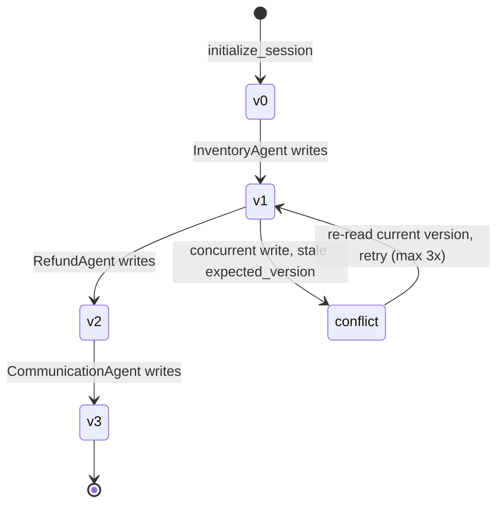

<div align="center">

# 🛒 NovaMart Multi-Agent Support

**A five-agent, production-shaped e-commerce support system on Amazon Bedrock AgentCore** — an
Orchestrator routes customer requests to four specialist workers, one of which runs its own
internal multi-agent RAG fan-out across three Bedrock Knowledge Bases in parallel. Every agent
shares one optimistic-locked DynamoDB record, runs behind a Bedrock Guardrail, and is traced
end-to-end on the X-Ray Service Map.

[](https://github.com/mahmoudnasser1561/agentcore-multi-agent-ecommerce-rag/actions/workflows/ci.yml)


| 🧭 **5 agents** | 📚 **Multi-agent RAG** | 🔒 **Optimistic locking** | 🛡️ **Guardrails** | 🧠 **Session memory** | 📊 **Full observability** |
|:-:|:-:|:-:|:-:|:-:|:-:|
| Orchestrator → 4 workers | 3 KBs in parallel | versioned WorkflowState | content/PII/topic policy | AgentCore Memory | CloudWatch + X-Ray |

</div>

---

## 🏗️ Architecture at a glance


The Orchestrator (Claude Haiku 4.5 — cheap, fast routing) never answers the customer itself. It
calls exactly one worker (Claude Sonnet 4.5) per step and persists that worker's result to a
shared DynamoDB row before deciding what happens next. The Policy worker is itself a small
multi-agent system: three single-purpose retriever sub-agents, one per Knowledge Base, queried
concurrently through a `ThreadPoolExecutor`.

---

## 🎬 Proof it's deployed, not just written

These are screenshots from the actual grading run against real AWS infrastructure — three
Bedrock Knowledge Bases backed by S3 Vectors, a live AgentCore Runtime, a published Guardrail,
and CloudWatch/X-Ray wired up. **Score: 120/120.**

> *"Now that's what I call a fine job! … The version-aware WorkflowState lifecycle is a notable
> foundation for reliable multi-agent coordination."* — reviewer feedback, first attempt

<table>
<tr>
<td width="50%" valign="top">

**Orchestration, deployment & guardrails** — Tasks 2–4


</td>
<td width="50%" valign="top">

**Parallel multi-agent RAG, live** — Task 5


</td>
</tr>
<tr>
<td valign="top">

**Final score — zero failures**


</td>
<td valign="top">

**X-Ray Service Map** — full call graph


</td>
</tr>
</table>

<div align="center">

<br/><sub>Orchestrator → 5 agent nodes → 3 knowledge base nodes, one trace per customer request</sub>
</div>

---

## 🔄 How one request flows


Every routing tool follows the same pattern: read WorkflowState's current `version`, run the
worker, write the result back under that version. The write is a **conditional** DynamoDB
update — it only succeeds if `version` still matches what was just read.



A lost race doesn't corrupt state or silently drop a result — it retries against a fresh read,
up to three times, then raises rather than looping forever.

---

## 📚 Multi-agent RAG — three knowledge bases, one round trip


The PolicyAgent's `search_all_policies` tool doesn't query three knowledge bases in sequence —
it fans the question out to three retriever sub-agents concurrently via `ThreadPoolExecutor`,
so a question touching all three domains (returns, shipping, warranty) costs one round trip's
wall-clock time, not three. A single retriever failing — a transient KB error — is reported
inline in its slot; it never aborts the other two.

---

## 🛡️ Guardrails — safety without blocking legitimate math

A Bedrock Guardrail is attached to **every** agent's model via one call
(`model.update_config(guardrail_id=..., guardrail_version=...)`), so a single policy change
takes effect across the whole graph at once. Three STANDARD-tier DENY topics: competitor
products, pricing negotiations, legal threats — plus content filters, PII redaction, and a
profanity word list.

The "pricing negotiations" topic is deliberately **narrow**: it blocks a customer trying to
haggle NovaMart down from an advertised price, but explicitly *excludes* arithmetic using a
price and discount the customer already stated. An early CLASSIC-tier version of this topic
was broad enough to block *"what's 15% off $120?"* — a real failure caught during verification,
not a hypothetical — which is why the final guardrail uses STANDARD tier with narrowly-scoped
topic definitions instead.

---

## ✅ What was verified where

| Capability | Live deployment (the grading run) |
|---|:-:|
| 5-agent Orchestrator → Workers routing | ✅ |
| Parallel multi-agent RAG (3 Knowledge Bases, S3 Vectors) | ✅ |
| Optimistic-locked WorkflowState | ✅ |
| Bedrock Guardrail (content, PII, topics, word list) | ✅ |
| AgentCore Memory (session summaries) | ✅ |
| CloudWatch logs + X-Ray Service Map | ✅ |
| **Graded score** | **120 / 120** |

---

## 📂 What's in this repository

```text
.
├── src/
│   ├── agent_orchestrator.py   # the exact file that was graded — unchanged
│   ├── config.py                # original — environment/CloudFormation config
│   ├── agent_utils.py           # original — terminal trace UI, colour constants
│   ├── agent_observability.py   # original — CloudWatch logging + X-Ray tracing
│   └── bedrock_kb_retrieval.py  # original — Knowledge Base Retrieve wrapper
├── docs/
│   ├── diagrams/                # PNG exports of the diagrams above
│   └── evidence/                # screenshots from the real deployment
├── .env.example
└── .github/workflows/ci.yml     # lint + import/wiring check on every push
```

`src/agent_orchestrator.py` is **exactly** the file that was submitted and graded — not a
rewrite, not a simplification. The four modules it imports were written as original, minimal
replacements for the course-provided versions of the same name, which are licensed
CC BY-NC-ND and can't be redistributed; this repo never includes any of the original course
scaffolding, starter README, or sample data. Everything under `src/` here is either the
student's own work or an original reimplementation of the same public interface.

---

## 🚀 Run it

```bash
uv sync
uv run ruff check .                                           # lint
AWS_ACCESS_KEY_ID=testing AWS_SECRET_ACCESS_KEY=testing \
  uv run python -c "import sys; sys.path.insert(0, 'src'); \
  import agent_orchestrator; agent_orchestrator.build_agent_graph()"   # builds offline, no AWS needed
```

Running it against real data needs your own AWS account: three DynamoDB tables, three Bedrock
Knowledge Bases backed by S3 Vectors, an AgentCore execution role, and a deployed AgentCore
Runtime. `.env.example` lists every value `config.py` expects.

```bash
python src/agent_orchestrator.py test     # 3 scripted scenarios, traced to X-Ray
python src/agent_orchestrator.py chat     # interactive terminal chat
python src/agent_orchestrator.py deploy   # guardrail, runtime, memory, observability
```

---

## 🧰 Skills demonstrated

| Area | Where to look |
|---|---|
| Multi-agent orchestration (Orchestrator → Workers) | `build_orchestrator_agent`, `build_agent_graph` |
| Multi-agent RAG, concurrent retrieval | `build_policy_agent` (`search_all_policies`) |
| Distributed state with optimistic locking | `_create_workflow_state`, `_update_workflow_state` |
| Enterprise guardrails, verified against live traffic | `create_guardrail` |
| AgentCore Runtime deployment, Memory, observability | `deploy_to_agentcore_runtime`, `configure_memory`, `configure_observability` |
| Production tracing (CloudWatch + X-Ray) | `src/agent_observability.py` |

---

<div align="center">

Built by **Mahmoud** ([@mahmoudnasser1561](https://github.com/mahmoudnasser1561)) · MIT licensed

</div>
