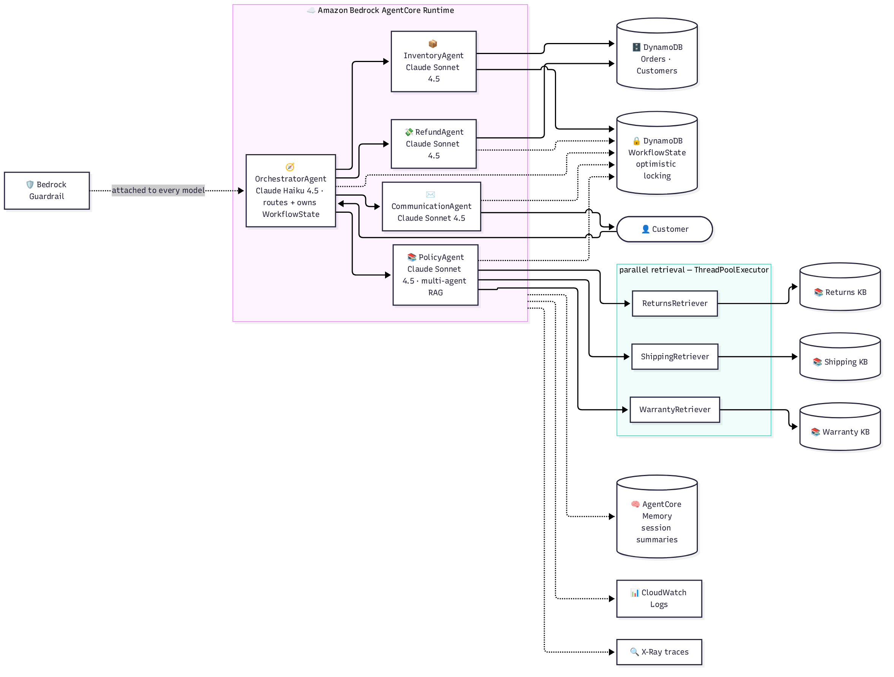
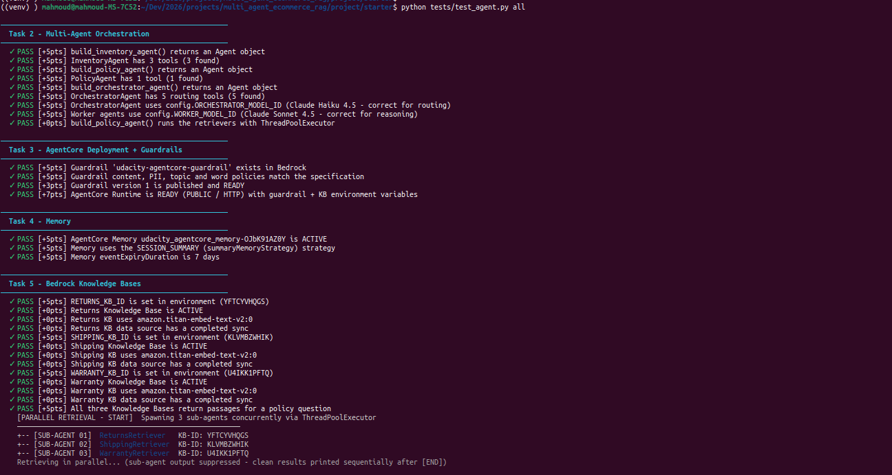
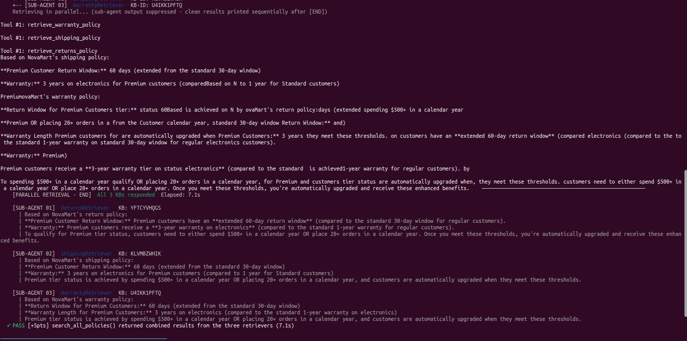
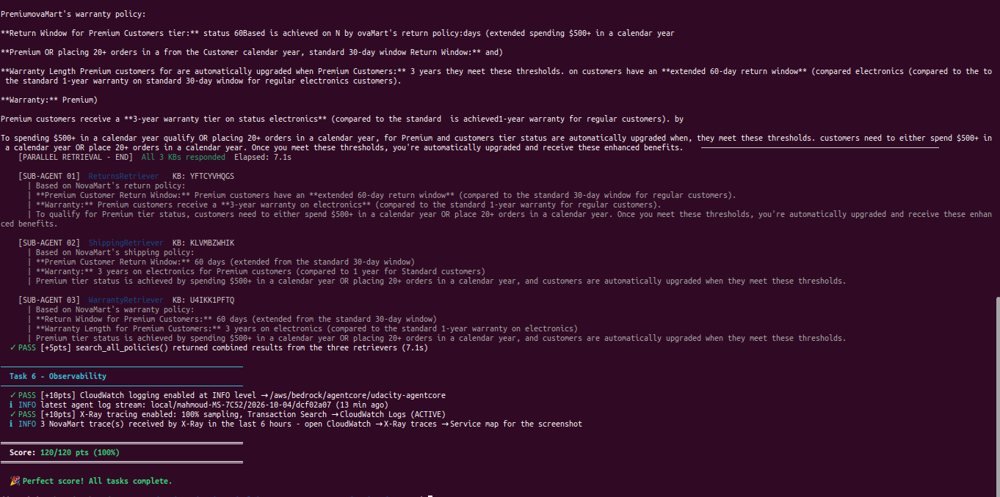
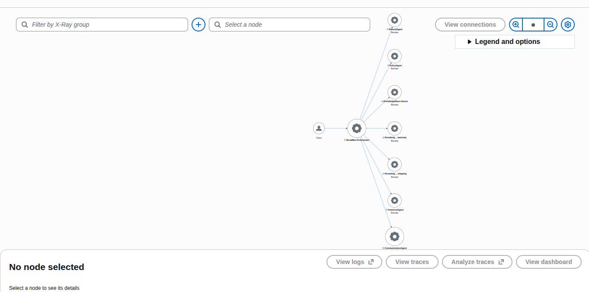
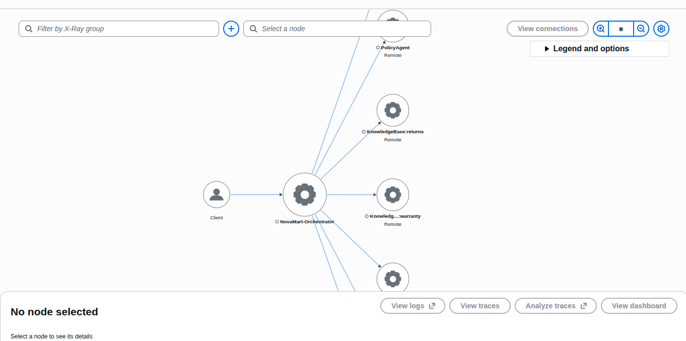
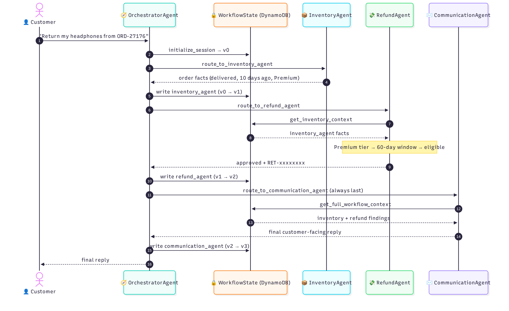
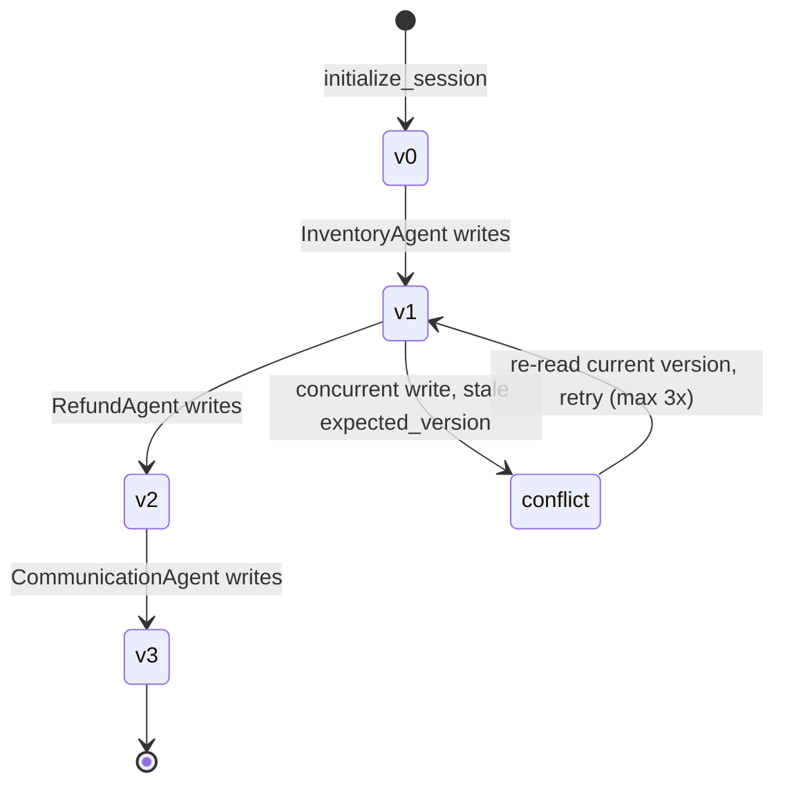
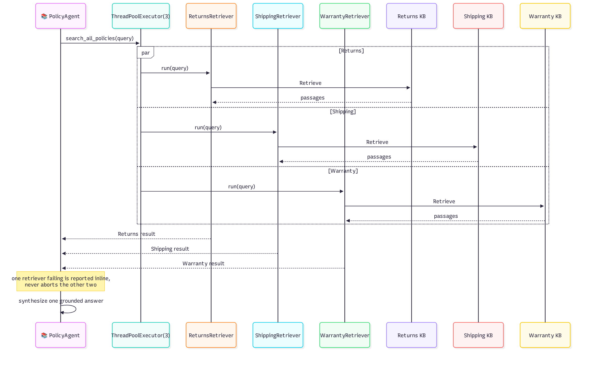

# NovaMart Multi-Agent Support

A five-agent e-commerce support system on Amazon Bedrock AgentCore, built for a fictional
company called NovaMart. One Orchestrator routes each customer request to four specialist
workers — Inventory, Refund, Policy, Communication — and the Policy worker is itself a small
multi-agent system, fanning a single question out to three Bedrock Knowledge Bases in
parallel. Every agent coordinates through one optimistic-locked DynamoDB record, runs behind
a shared Bedrock Guardrail, and the whole request graph is traceable end-to-end on the X-Ray
Service Map.

[](https://github.com/mahmoudnasser1561/agentcore-multi-agent-ecommerce-rag/actions/workflows/ci.yml)


Python 3.12 · Amazon Bedrock AgentCore · DynamoDB · S3 Vectors · Strands Agents SDK

## The system



The Orchestrator runs a fast, cheap routing model and never answers the customer directly —
it calls exactly one worker per step (a stronger reasoning model) and persists that worker's
result to a shared DynamoDB row before deciding what happens next. The Policy worker holds
three single-purpose retriever sub-agents, one per Knowledge Base, queried concurrently
through a `ThreadPoolExecutor` rather than in sequence.

A simpler, single-glance version of this diagram — built for sharing outside the repo — is at
`docs/diagrams/overview-agentic-system.svg`.

## It actually ran on AWS, not just in an editor

The screenshots below come from a full verification run against real AWS infrastructure:
three Bedrock Knowledge Bases backed by S3 Vectors, a live AgentCore Runtime, a published
Guardrail, CloudWatch and X-Ray wired up.

> *"Now that's what I call a fine job! … The version-aware WorkflowState lifecycle is a notable
> foundation for reliable multi-agent coordination."* — technical review feedback

Verified against live infrastructure: 5-agent Orchestrator → Workers routing · parallel
multi-agent RAG across 3 Knowledge Bases · optimistic-locked WorkflowState · the Guardrail
(content, PII, topics, word list) · AgentCore Memory · CloudWatch logs + the X-Ray Service Map
below — every capability checked, nothing skipped.

<table>
<tr>
<td width="50%" valign="top">

**Orchestration, deployment & guardrails**


</td>
<td width="50%" valign="top">

**Parallel multi-agent RAG, live**


</td>
</tr>
<tr>
<td valign="top">

**Full test suite — zero failures**


</td>
<td valign="top">

**X-Ray Service Map** — full call graph


</td>
</tr>
</table>



*Orchestrator → 5 agent nodes → 3 knowledge base nodes, one trace per customer request.*

## Why `src/agent_orchestrator.py` looks unusual for a portfolio repo

It's **exactly** the file as built and verified against live AWS infrastructure — not a
rewrite, not a cleaned-up simplification. It was developed as part of an AWS-sponsored
technical training program; the four modules it imports (`config.py`, `agent_utils.py`,
`agent_observability.py`, `bedrock_kb_retrieval.py`) are original, from-scratch replacements
for that program's own versions of the same name, written to match the same public interface
so this file runs unmodified. The program's own scaffolding, starter README and sample data
are licensed CC BY-NC-ND and are not included anywhere in this repository — only the parts
that are original authorship, or an original reimplementation.

## Request lifecycle



Every routing tool shares one pattern: read WorkflowState's current `version`, run the worker,
write the result back conditioned on that version. The write only succeeds if `version` still
matches what was just read.



A lost race doesn't corrupt state or drop a result silently — it retries against a fresh read,
up to three times, then raises rather than looping forever.

## Multi-agent RAG: three knowledge bases, one round trip



`search_all_policies` doesn't query three knowledge bases in sequence — it fans the question
out to three retriever sub-agents concurrently, so a question touching all three domains
(returns, shipping, warranty) costs one round trip's wall-clock time, not three. A single
retriever failing — a transient KB error — is reported inline in its own slot and never
aborts the other two.

## Tuning the guardrail against a real false positive

A Bedrock Guardrail attaches to every agent's model through one call
(`model.update_config(guardrail_id=..., guardrail_version=...)`), so a single policy change
takes effect across the whole graph at once. It carries three STANDARD-tier DENY topics —
competitor products, pricing negotiations, legal threats — plus content filters, PII
redaction, and a profanity word list.

The "pricing negotiations" topic is deliberately narrow: it blocks a customer haggling
NovaMart down from an advertised price, but explicitly excludes arithmetic using a price and
discount the customer already stated. An earlier, CLASSIC-tier version of this topic was wide
enough to block *"what's 15% off $120?"* outright — caught during live verification, not a
hypothetical — which is why the shipped guardrail uses STANDARD tier with narrowly-scoped
topic text instead.

## Repository layout

```text
.
├── src/
│   ├── agent_orchestrator.py   # the exact file as built and verified — unchanged
│   ├── config.py                # original — environment/CloudFormation config
│   ├── agent_utils.py           # original — terminal trace UI, colour constants
│   ├── agent_observability.py   # original — CloudWatch logging + X-Ray tracing
│   └── bedrock_kb_retrieval.py  # original — Knowledge Base Retrieve wrapper
├── docs/
│   ├── diagrams/                # the diagrams above, plus a simpler standalone overview
│   └── evidence/                # screenshots from the real deployment
├── .env.example
└── .github/workflows/ci.yml     # lint + import/wiring check on every push
```

## Running it

Offline — no AWS account needed, this is what CI runs on every push:

```bash
uv sync
uv run ruff check .
AWS_ACCESS_KEY_ID=testing AWS_SECRET_ACCESS_KEY=testing \
  uv run python -c "import sys; sys.path.insert(0, 'src'); \
  import agent_orchestrator; agent_orchestrator.build_agent_graph()"
```

Against real data, you'll need your own AWS account: three DynamoDB tables, three Bedrock
Knowledge Bases backed by S3 Vectors, an AgentCore execution role, and a deployed AgentCore
Runtime. `.env.example` lists every value `config.py` expects.

```bash
python src/agent_orchestrator.py test     # 3 scripted scenarios, traced to X-Ray
python src/agent_orchestrator.py chat     # interactive terminal chat
python src/agent_orchestrator.py deploy   # guardrail, runtime, memory, observability
```

---

Mahmoud — [github.com/mahmoudnasser1561](https://github.com/mahmoudnasser1561). Licensed MIT, see [`LICENSE`](LICENSE).
